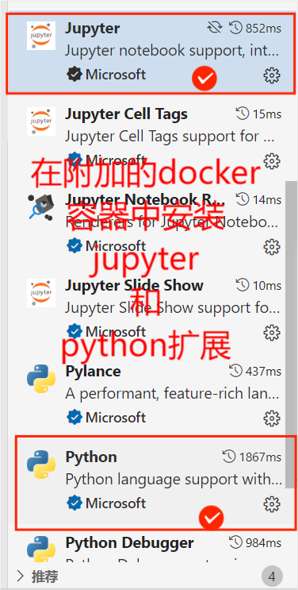

# 使用Dockerfile快速构建PyTorch版本d2l深度学习教程运行环境

## 本仓库的目的

- 构建一个Docker镜像来运行d2l notebook，可以在主流操作系统（Windows、macOS、Ubuntu Linux等）上运行，适合多种平台上的用户。
- 使用基于项目的python包管理器uv（或poetry），避免软件包版本冲突，提高项目的可移植性。
- 不拘泥于d2l学习项目，也可以作为未来构建自己的机器学习项目作为参考。

## 使用教程

下面将详细介绍如何使用本仓库的方法构建docker镜像；

### 预备

#### Docker与 WSL2简介

> Docker 是一种 **容器化技术** ，允许开发者将应用及其依赖打包到一个轻量级、可移植的“容器”中。容器共享操作系统内核，但彼此隔离，确保环境一致性。通过 Docker，应用可在任何支持容器的系统（如开发机、云服务器）中快速部署，解决“本地能跑，线上报错”的问题，提升开发和运维效率。
>
> **WSL2** （Windows Subsystem for Linux 第二代）是微软推出的轻量级虚拟机技术，允许在Windows中直接运行完整的Linux内核及工具链。相比初代WSL1，它通过虚拟化实现更高的系统兼容性和性能（尤其文件I/O和进程调用）。
>
> **为什么Windows Docker需用WSL2？**
>
> 1. **性能提升** ：传统Windows Docker依赖Hyper-V虚拟机，资源消耗大且文件读写慢。WSL2提供轻量级Linux环境，容器直接运行其中，文件操作效率接近原生Linux。
> 2. **内核兼容性** ：Docker依赖Linux内核特性（如cgroups、命名空间），WSL2内置完整Linux内核，无需额外虚拟化层即可支持容器。
> 3. **无缝集成** ：Docker Desktop默认基于WSL2，可直接调用Linux工具链，实现开发、调试与部署环境统一。
> 4. **资源效率** ：WSL2动态分配内存/CPU，与Windows共享资源，启动更快且占用更低。
>
> 简言之，WSL2让Windows用户以接近原生体验高效运行Docker，解决环境割裂与性能瓶颈。
>
> 以上内容来自deepseek

参考链接：

- [Docker官方文档](https://docs.docker.com/get-started/)
- [WSL2官方文档](https://learn.microsoft.com/zh-cn/windows/wsl/about)

#### 如果你是Windows用户，请先安装WSL2

对于Windows用户，需要用WSL2作为docker的后端，可以直接按照[微软官方安装教程](https://learn.microsoft.com/zh-cn/windows/wsl/install)进行安装。这里摘录部分关键信息：

> 必须运行 Windows 10 版本 2004 及更高版本（内部版本 19041 及更高版本）或 Windows 11 才能使用以下命令。 如果使用的是更早的版本，请参阅[手动安装页](https://learn.microsoft.com/zh-cn/windows/wsl/install-manual)。

> - 在管理员模式下打开 PowerShell 或 Windows 命令提示符，方法是右键单击并选择“以管理员身份运行”
> - 输入 `wsl --install` 命令，等待程序安装完毕
> - 重启计算机。
>
>   ——微软官方文档

注：`wsl --install`默认选择安装Ubuntu，可以使用 `wsl --install -d debian` 指定安装Debian Linux发行版

#### 安装Docker：

对于新手，可以直接从[Docker官网](https://www.docker.com/)上下载Docker Desktop的安装包。注意选择适合自己电脑处理器架构的安装包。


下载完成后依照指示安装即可。

注：

1. 对于Windows用户，安装完毕后可以同时在Windows PowerShell和WSL2 终端中使用docker命令。


2. Windows系统内置的Power Shell版本较为落后，如果你喜欢使用 PowerShell，建议[安装PowerShell 7](https://github.com/PowerShell/powershell/releases)并将它设置为Windows系统默认终端。

其他安装教程的参考链接：

[- 菜鸟教程：Windows Docker](https://www.runoob.com/docker/windows-docker-install.html)

### 项目结构

请仔细阅读注释

```
# Dockerfile文件，用于构建Docker镜像
├── d2l-uv.Dockerfil			# （推荐）只使用uv，只下载cpu版本的torch
├── d2l-poetry-all.Dockerfile 		# （不推荐）使用miniconda + poetry，下载全部版本的torch，包含gpu版本
├── d2l-poetry.Dockerfile 		# （不推荐）使用miniconda + poetry，只下载cpu版本的torch
#python项目文件，用于在Docker镜像构建过程中配置python环境
├── pyproject.toml 			# python项目文件
├── setup.py				# python
#其他文件
├── docker-proxy.txt 			# 记录了docker镜像站，用于加速docker pull过程，防止因为网络问题无法构建
└── README.md				# 项目介绍文档，你正在阅读这个文件
```

### 构建Docker镜像

#### Docker换源（可选）

由于某些原因，Docker的官方镜像仓库Docker Hub已经不能在中国大陆直接访问。这里可以选择向Docker配置文件中添加镜像站点解决这个问题。当然，如果你能够用其他方式正常连接到Docker Hub，可以忽略这一小节的内容。

**注意：本仓库获得的Docker镜像站点均从互联网上检索得到，不对镜像站点的安全性和可用性负责。**

将仓库中文件 `docker-proxy.txt`内容复制到Dockers Desktop Settings （界面右上齿轮图标）-> Docker Engine处的配置文件中。注意在配置文件添加新内容时，上一行末尾要补上英文逗号“,”。


#### 运行docker build 命令

在终端中将当前工作目录切换到克隆的本仓库目录下，本教程中仓库目录为“C:\Users\\用户名\Documents\GitHub\d2l-pytorch-docker”。

对于Windows用户，这一步既可以在Windows的Power Shell中执行，也可以在WSL2的Linux终端中执行。以下教程使用WSL2的Linux终端执行。

```
cd /mnt/c/Users/用户名/Documents/GitHub/d2l-pytorch-docker #WSL2 Linux 终端

cd C:\Users\用户名\Documents\GitHub\d2l-pytorch-docker #Windows PowerShell
```

再执行以下命令构建镜像，本教程中默认使用 `d2l-uv.Dockerfile` 配置文件构建镜像，等待构建完毕即可。

```
docker build -t d2l-pytorch-uv -f mnt/c/Users/用户名/Documents/Github/d2l-pytorch-docker/d2l-uv.Dockerfile .
```


注意事项：

本配置文件为保证兼容性和节约构建时间与硬盘空间，只下载cpu版本的torch软件包。但cpu版本的torch软件包在很多国内镜像源中缺失，只能指定从torch官网下载，可能存在下载缓慢的问题。

### 启动Docker容器

执行以下命令运行构建好的 `d2l-pytorch-uv`镜像，用交互式终端启动一个名为“d2l-docker”的docker容器，该容器将在退出后自动删除。

```
docker run -it --rm --name d2l-docker -v /mnt/c/Users/用户名/Documents/GitHub/d2l-zh:/root/d2l-pytorch d2l-pytorch-uv:latest 
```


此时可在Docker Desktop Dashboard中看到已经启动的容器。


注意事项：

1. 运行Docker容器前请先从d2l官方仓库中克隆源码。`d2l-uv.Dockerfile`在镜像中创建了 `/root/d2l-pytorch`目录，以备挂载d2l源码。

2. 建议在挂载后通过 `cp -r` 命令克隆一份源码，缓解跨文件系统挂载导致io效率低下的问题。亦可使用docker volume的方式挂载。

### VS Code 连接Docker容器

首先要在**本机VS Code扩展商店**中安装好Docker 扩展。


随后点击左侧菜单栏中的Docker图标，在CONTAINERS一栏中右键正在运行的容器，选择“附加Visual Studio Code”。


在**附加到的docker容器中VS Code扩展商店**中搜索并安装扩展“Jupyter”和“Python”。



安装完成扩展后，选择任意的notebook文件执行，发现可以正常显示并运行，说明环境配置成功。


注意事项：

1. d2l中部分章节需要下载数据集，建议先在主机下载好后，存放到d2l源码的data目录中，再挂载源码文件夹到docker容器中运行。
2. 使用shell命令 `uv pip list | grep -E "(torch)+|(d2l)+|(notebook)+"`可以查找是否成功安装d2l所需的软件包。如果缺少软件包而无法运行，建议切换网络后重新构建镜像。
3. 可以选择暂停docker容器，或者在启动容器时去除“--rm”，可反复重用一个容器。
4. 针对同一个docker镜像，即使容器每次运行结束后被自动删除，VS Code也会缓存其中安装的插件，下次启动新容器时无需重新下载“Jupyter”和“Python”扩展。
